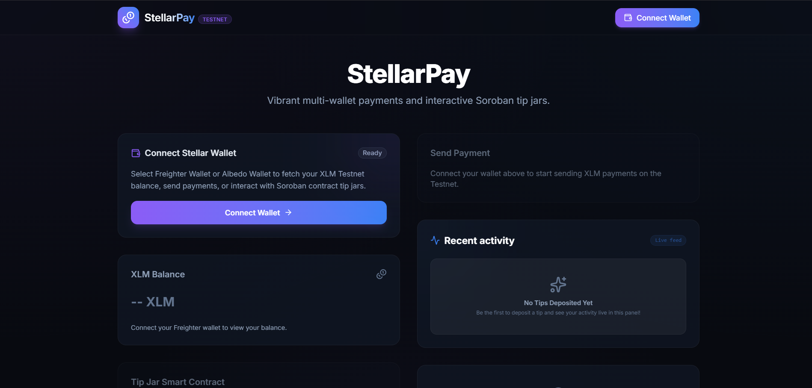
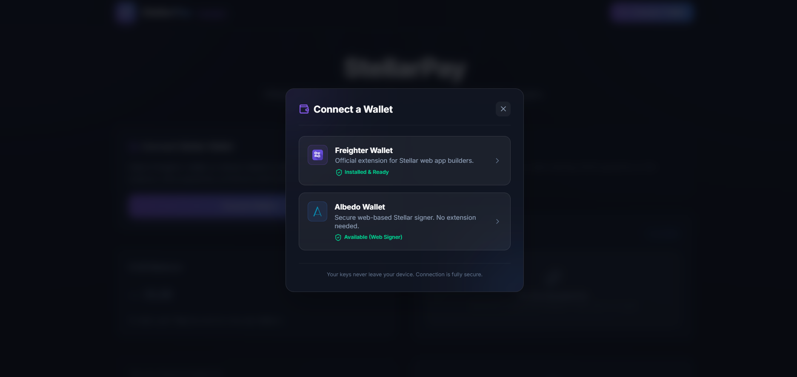
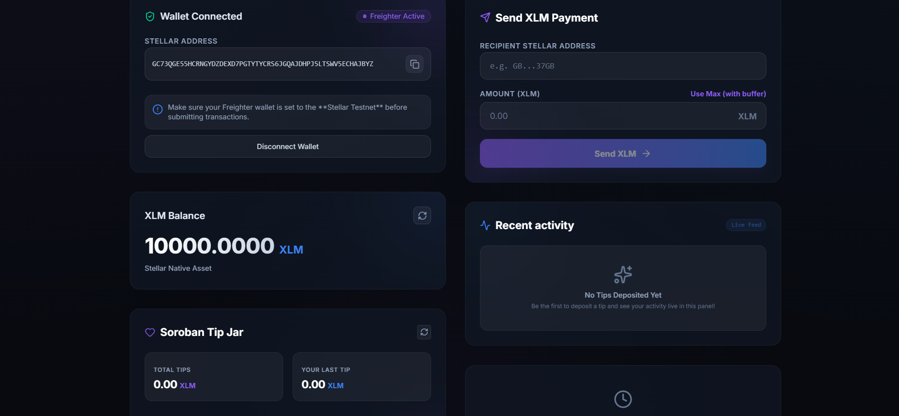
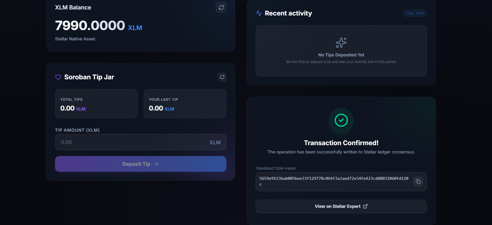
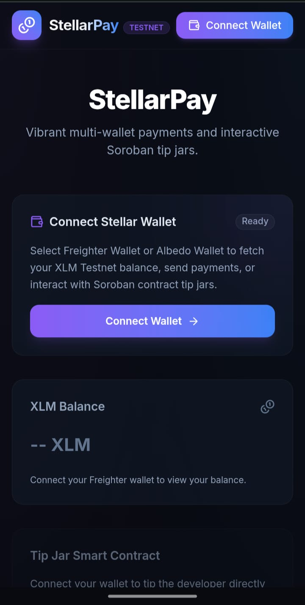

# StellarPay 🚀

A Level 2 Stellar & Soroban dApp built on the Stellar Testnet using React, Vite, Tailwind CSS, and Soroban Smart Contracts.

StellarPay allows users to connect Stellar wallets, view balances, send XLM payments, interact with a deployed Soroban smart contract, and track contract activity in real time through a modern, responsive interface.

---

## 🌐 Live Demo

**Live Application:**
https://stellar-gules.vercel.app/

---

## 📹 Demo Video

Watch the complete project demonstration:

https://youtu.be/43TlF08FKHo?si=Bj6gf8dkNGhYAJM-

---

## 📂 GitHub Repository

https://github.com/PixelPerfect31/Stellar

---

## ✨ Features

### Multi-Wallet Support

* Freighter Wallet Integration
* Albedo Wallet Integration
* Wallet Connect / Disconnect
* Automatic wallet persistence using localStorage

### Balance Management

* Fetch Stellar Testnet XLM balance
* Real-time balance updates
* Friendbot funding support

### XLM Transactions

* Send XLM payments on Stellar Testnet
* Input validation
* Success and failure notifications
* Transaction hash tracking

### Soroban Smart Contract

* Deposit tips into Tip Jar contract
* Read contract state
* Real-time contract interaction
* Event monitoring

### Transaction Status Tracking

Displays transaction stages:

* Preparing
* Awaiting Signature
* Submitting
* Pending Confirmation
* Confirmed
* Failed

### Error Handling

Handles multiple error types:

* WalletNotInstalledError
* UserRejectedTransactionError
* NetworkError
* InsufficientBalanceError
* ContractExecutionError

---

## 🔗 Smart Contract Information

| Item | Value |
|--------|--------|
| Network | Stellar Testnet |
| Contract ID | CBLZAL7HCFIGW3M2HPQ6IHURYHL7EYVMMHEABDINE5VY52BPDXVHO4ST |
| Smart Contract | Soroban Tip Jar |
| Status | Deployed Successfully |
| Deployment Transaction Hash | 8eb5cfea4f808f74be193a63f11de68995034ad751181295a98503e932c42a20 |
| Contract Interaction Hash | fb354f5e9fcaf47794a45dd9549bd992668fb3b5b9b792c753e5314f8435ec4c |
## 🛠 Tech Stack

### Frontend

* React 19
* Vite
* Tailwind CSS
* React Toastify

### Blockchain

* Stellar SDK
* Soroban Smart Contracts
* Horizon API
* Soroban RPC

### Wallets

* Freighter Wallet
* Albedo Wallet

### Deployment

* GitHub
* Vercel
* GitHub Actions

---

## 📁 Project Structure

```text
contracts/
└── tipjar/

src/
├── components/
├── config/
├── contracts/
├── events/
├── services/
├── utils/
├── wallets/

README.md
package.json
```

---

## 🚀 Installation & Setup

### Clone Repository

```bash
git clone https://github.com/PixelPerfect31/Stellar.git
cd Stellar
```

### Install Dependencies

```bash
npm install
```

### Run Development Server

```bash
npm run dev
```

Application runs at:

```text
http://localhost:5173
```

---

## 🧪 Build Project

```bash
npm run build
```

---

## 📸 Screenshots

### Home Dashboard



### Wallet Connection



### Connected Wallet & Balance



### Transaction Success



### Mobile Responsive View



---

## ⚙️ Soroban Contract Deployment

### Build Contract

```bash
stellar contract build
```

### Deploy Contract

```bash
stellar contract deploy \
--wasm target/wasm32v1-none/release/soroban_tipjar_contract.wasm \
--source deployer \
--network testnet
```

### Contract ID

```text
CBLZAL7HCFIGW3M2HPQ6IHURYHL7EYVMMHEABDINE5VY52BPDXVHO4ST
```

---

## 🔄 CI/CD

GitHub Actions automatically:

* Install dependencies
* Run validation checks
* Build project
* Verify deployment readiness

Workflow file:

```text
.github/workflows/ci.yml
```

---

## ✅ Level 2 Requirements Completed

* Wallet Connect Functionality
* Wallet Disconnect Functionality
* Freighter Integration
* Albedo Integration
* Multi-Wallet Support
* Balance Fetching
* XLM Transaction Support
* Contract Deployed on Testnet
* Frontend Contract Interaction
* Real-Time Event Integration
* Transaction Status Tracking
* Error Handling
* Mobile Responsive UI
* Public GitHub Repository
* GitHub Actions CI/CD
* Vercel Deployment
* README Documentation
* Demo Video

---

## 📈 Git Commit History

* feat: add multi-wallet support with Freighter and Albedo integration
* feat: implement Soroban tip jar contract and frontend contract interactions
* feat: add real-time event subscriptions and transaction status tracking
* refactor: improve error handling, UI polish, and production readiness
* feat: complete Stellar Level 2 with deployed Soroban Tip Jar

---

## 🔗 Useful Links

### Stellar Documentation

https://developers.stellar.org/

### Soroban Documentation

https://soroban.stellar.org/

### Stellar Expert Explorer

https://stellar.expert

---

## 👨‍💻 Developer

**Rahul**

Built as part of the Stellar Developer Program Level 2 Challenge using Stellar, Soroban, React, and Vercel.
